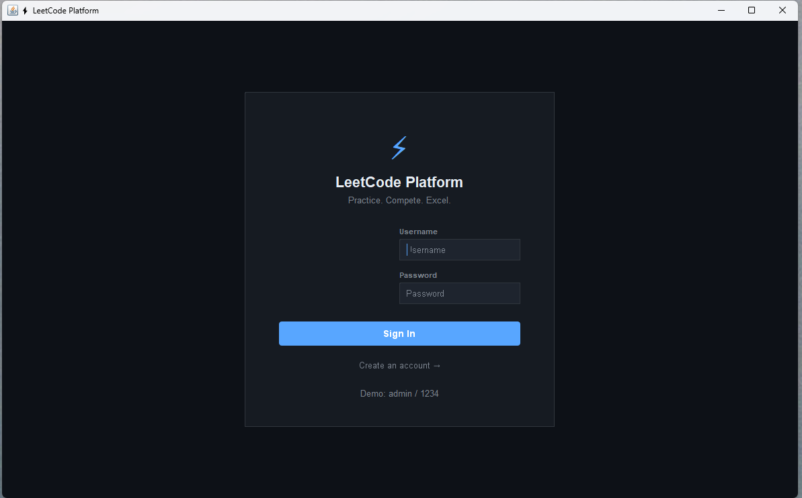
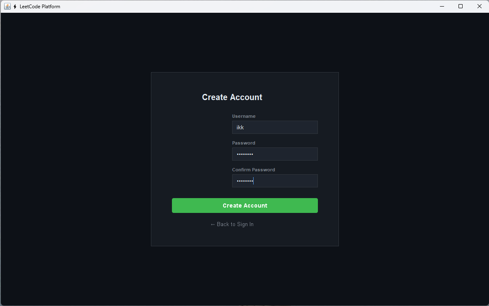
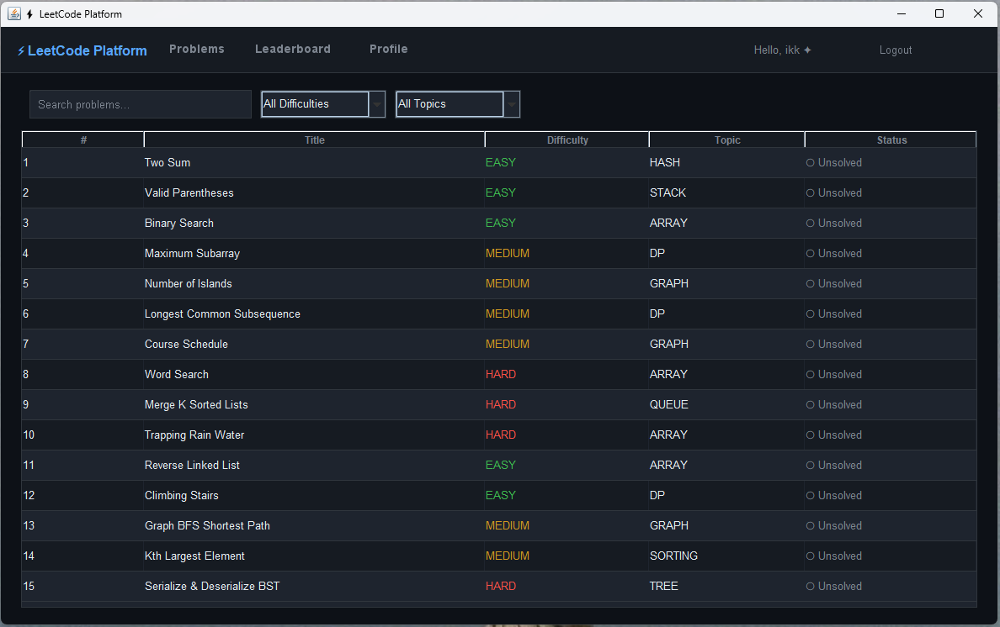
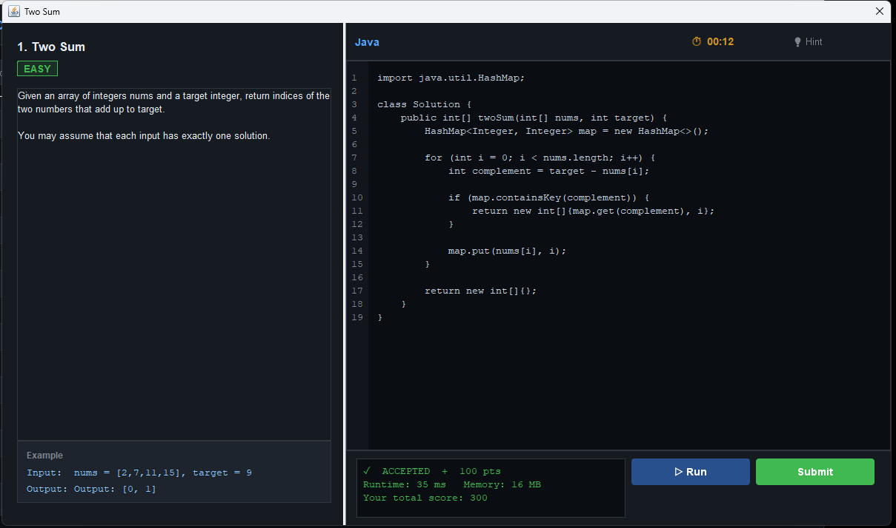
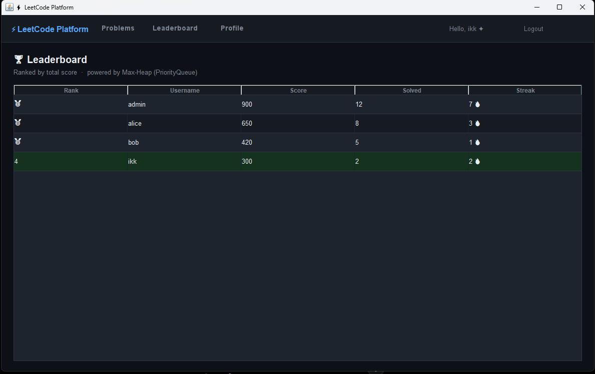
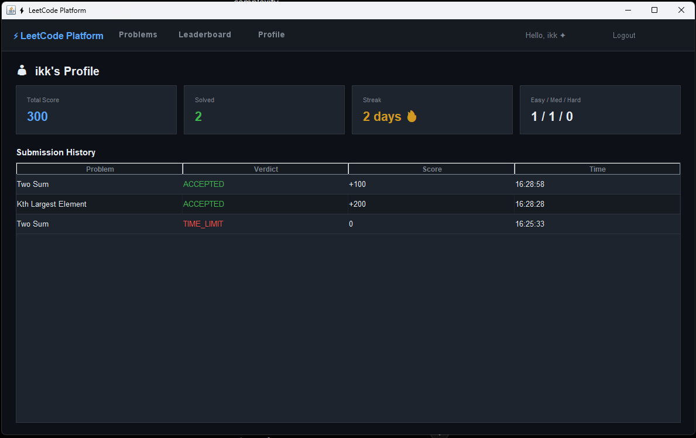

# ⚡ Mini LeetCode Platform

A modern **LeetCode-inspired coding platform** built entirely in **a single Java file** using **Java Swing**.

This project demonstrates how multiple **Data Structures & Algorithms** can be integrated into a real desktop application while providing an interactive coding experience similar to LeetCode.

> Designed for B.Tech CSE DSA Projects and Java Swing Development.

---

# 📷 Screenshots

## 🔐 Login Screen



---

## 🏠 Create Account



---

## 📚 Problem List



---

## 💻 Code Editor



---

## 🏆 Leaderboard



---

## 👤 User Profile



---

# ✨ Features

### 👤 User Management
- Login
- Registration
- User Profiles
- Submission History
- Score Tracking
- Solved Problems

---

### 📚 Problem Management

- Browse coding problems
- Difficulty Filters
- Topic Filters
- Problem Search
- Trie-based Auto Suggestions
- Related Problems Recommendation

---

### 💻 Online Coding Interface

- Built-in Java Code Editor
- Line Numbers
- Sample Test Cases
- Run Button
- Submit Button
- Hint System
- Timer

---

### ⚖ Online Judge Simulation

- Accepted
- Wrong Answer
- Compile Error
- Time Limit Exceeded

---

### 🏆 Leaderboard

- Live Ranking
- Score System
- Streak Tracking
- Solved Count
- Priority Queue (Max Heap)

---

### 📈 Profile Dashboard

- Total Score
- Solved Questions
- Daily Streak
- Difficulty Statistics
- Submission History

---

# 🧠 Data Structures Used

| Data Structure | Purpose |
|---------------|---------|
| HashMap | User Management |
| Trie | Problem Search Suggestions |
| Queue | Online Judge Queue |
| Stack | Stack Problems |
| PriorityQueue | Leaderboard |
| Graph | Related Problems |
| BFS | Graph Traversal |
| ArrayList | Problem Storage |
| HashSet | Solved Problems |

---

# ⚙ Algorithms Used

- Breadth First Search (BFS)
- Trie Search
- Priority Queue (Heap)
- Hashing
- Graph Traversal
- Sorting
- Dynamic Programming (Examples)
- Stack Based Algorithms
- Queue Simulation

---

# 🎯 Sample Problems Included

- Two Sum
- Valid Parentheses
- Binary Search
- Maximum Subarray
- Number of Islands
- Longest Common Subsequence
- Course Schedule
- Word Search
- Merge K Sorted Lists
- Trapping Rain Water
- Reverse Linked List
- Climbing Stairs
- Graph BFS
- Kth Largest Element
- Serialize & Deserialize BST

---

# 🛠 Technologies Used

- Java
- Java Swing
- AWT
- Object Oriented Programming
- Data Structures & Algorithms

---

# 🚀 Project Structure

```
Mini-LeetCode-Platform
│
├── LeetCodePlatform.java
├── README.md
└── screenshots
    ├── login.png
    ├── dashboard.png
    ├── problems.png
    ├── editor.png
    ├── leaderboard.png
    └── profile.png
```

---

# ▶ How to Run

### Clone Repository

```bash
git clone https://github.com/yourusername/Mini-LeetCode-Platform.git
```

### Compile

```bash
javac LeetCodePlatform.java
```

### Run

```bash
java LeetCodePlatform
```

---

# 🎓 Educational Purpose

This project was developed to demonstrate practical implementation of:

- Data Structures
- Algorithms
- Java Swing
- Desktop GUI Development
- Object Oriented Programming

---

# ⭐ Future Improvements

- Real Java Compiler Integration
- SQL Database
- Spring Boot Backend
- REST APIs
- Authentication using JWT
- Contest Mode
- Dark/Light Themes
- Code Execution Sandbox
- AI Hint System

---

# 👨‍💻 Author

**Ishit Kumar Kanojia**

B.Tech Computer Science & Engineering

---
